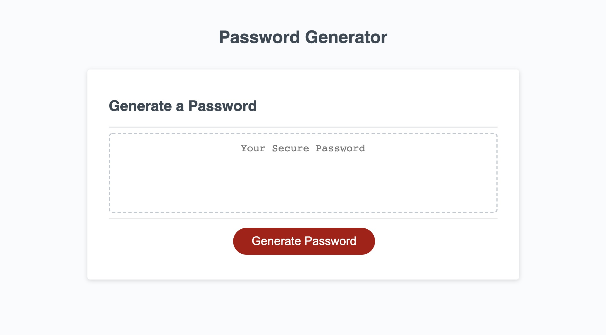
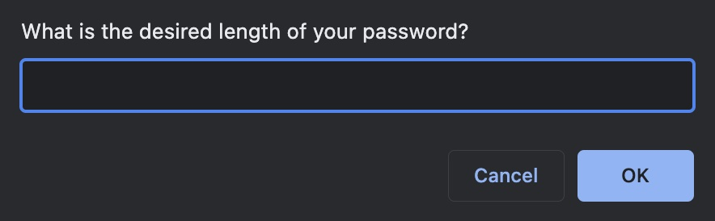
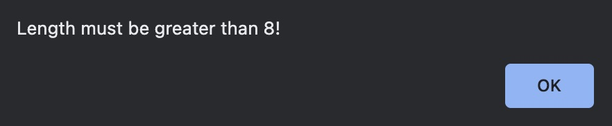

# Password-Generator

## Description

This project includes a modification and rework of starter code to create an application that enables an individual to generate random passwords based on criteria selected such as number of characters and type of characters (ie. uppercase, lowercase, numbers, special characters). The code is easy to follow with clear commenting and simplified into as few lines as possible. 

## Visuals

## Link

Link to Repository : https://github.com/giovannaruggio/password-generator

Link to Deployed Application : https://giovannaruggio.github.io/password-generator/